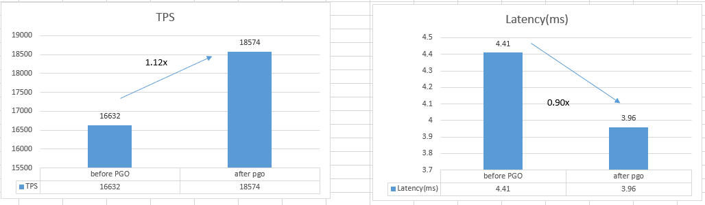

# OceanBase Profiling Optimizaiton
## Guide
* https://johnysswlab.com/tune-your-programs-speed-with-profile-guided-optimizations/

## The file to enable PGO
* /path/to/oceanbase-master/deps/oblib/src/CMakeLists.txt
* /path/to/oceanbase-master/src/CMakeLists.txt
* /path/to/oceanbase-master/deps/easy/CMakeLists.txt
* /path/to/oceanbase-master/cmake/Env.cmake

## stop the oceanbase
<pre>kill -15 `pgrep observer`</pre>

## Sysbench Read Only
Sysbench cmd: 
<pre>cd /home/zhr/sysbench-1.0.20/src/;sysbench ./lua/oltp_read_only.lua --mysql-host=127.0.0.1 --mysql-port=2881 --mysql-db=test --mysql-user=root@sysbench_tenant --table_size=100000 --tables=30 --threads=64 --report-interval=10 --time=180 run</pre>

### PGO result

detail result your can ref (./merg.xlsx)

###  --table_size=100000 --tables=30 --threads=64 --report-interval=10 --time=180 run 
#### Before PGO
<pre>
[ 10s ] thds: 64 tps: 16466.88 qps: 263522.64 (r/w/o: 230582.67/0.00/32939.97) lat (ms,95%): 4.49 err/s: 0.00 reconn/s: 0.00
[ 20s ] thds: 64 tps: 16641.02 qps: 266255.43 (r/w/o: 232973.79/0.00/33281.64) lat (ms,95%): 4.41 err/s: 0.00 reconn/s: 0.00
[ 30s ] thds: 64 tps: 16645.15 qps: 266328.26 (r/w/o: 233037.77/0.00/33290.50) lat (ms,95%): 4.41 err/s: 0.00 reconn/s: 0.00
[ 40s ] thds: 64 tps: 16670.81 qps: 266720.79 (r/w/o: 233379.16/0.00/33341.62) lat (ms,95%): 4.41 err/s: 0.00 reconn/s: 0.00
[ 50s ] thds: 64 tps: 16671.73 qps: 266763.09 (r/w/o: 233419.33/0.00/33343.76) lat (ms,95%): 4.41 err/s: 0.00 reconn/s: 0.00
[ 60s ] thds: 64 tps: 16698.02 qps: 267163.84 (r/w/o: 233767.90/0.00/33395.94) lat (ms,95%): 4.41 err/s: 0.00 reconn/s: 0.00
[ 70s ] thds: 64 tps: 16689.87 qps: 267029.30 (r/w/o: 233649.76/0.00/33379.54) lat (ms,95%): 4.41 err/s: 0.00 reconn/s: 0.00
[ 80s ] thds: 64 tps: 16571.62 qps: 265156.41 (r/w/o: 232012.87/0.00/33143.54) lat (ms,95%): 4.41 err/s: 0.00 reconn/s: 0.00
[ 90s ] thds: 64 tps: 16579.53 qps: 265274.21 (r/w/o: 232115.24/0.00/33158.96) lat (ms,95%): 4.41 err/s: 0.00 reconn/s: 0.00
[ 100s ] thds: 64 tps: 16655.51 qps: 266489.03 (r/w/o: 233178.02/0.00/33311.02) lat (ms,95%): 4.41 err/s: 0.00 reconn/s: 0.00
[ 110s ] thds: 64 tps: 16488.43 qps: 263811.73 (r/w/o: 230834.76/0.00/32976.97) lat (ms,95%): 4.41 err/s: 0.00 reconn/s: 0.00
[ 120s ] thds: 64 tps: 16682.49 qps: 266920.31 (r/w/o: 233555.32/0.00/33364.99) lat (ms,95%): 4.41 err/s: 0.00 reconn/s: 0.00
[ 130s ] thds: 64 tps: 16614.81 qps: 265831.30 (r/w/o: 232601.88/0.00/33229.43) lat (ms,95%): 4.41 err/s: 0.00 reconn/s: 0.00
[ 140s ] thds: 64 tps: 16637.71 qps: 266207.70 (r/w/o: 232932.37/0.00/33275.32) lat (ms,95%): 4.41 err/s: 0.00 reconn/s: 0.00
[ 150s ] thds: 64 tps: 16657.27 qps: 266520.79 (r/w/o: 233206.35/0.00/33314.44) lat (ms,95%): 4.41 err/s: 0.00 reconn/s: 0.00
[ 160s ] thds: 64 tps: 16660.19 qps: 266556.73 (r/w/o: 233236.06/0.00/33320.68) lat (ms,95%): 4.41 err/s: 0.00 reconn/s: 0.00
[ 170s ] thds: 64 tps: 16684.39 qps: 266949.79 (r/w/o: 233581.00/0.00/33368.79) lat (ms,95%): 4.41 err/s: 0.00 reconn/s: 0.00
[ 180s ] thds: 64 tps: 16685.58 qps: 266970.61 (r/w/o: 233599.65/0.00/33370.96) lat (ms,95%): 4.41 err/s: 0.00 reconn/s: 0.00
SQL statistics:
    queries performed:
        read:                            41917400
        write:                           0
        other:                           5988200
        total:                           47905600
    transactions:                        2994100 (16632.62 per sec.)
    queries:                             47905600 (266121.87 per sec.)
    ignored errors:                      0      (0.00 per sec.)
    reconnects:                          0      (0.00 per sec.)

General statistics:
    total time:                          180.0122s
    total number of events:              2994100

Latency (ms):
         min:                                    2.95
         avg:                                    3.85
         max:                                   41.11
         95th percentile:                        4.41
         sum:                             11515092.18

Threads fairness:
    events (avg/stddev):           46782.8125/1810.85
    execution time (avg/stddev):   179.9233/0.01
</pre>
#### During PGO
<pre>
[ 10s ] thds: 64 tps: 218.55 qps: 3567.25 (r/w/o: 3123.94/0.00/443.31) lat (ms,95%): 337.94 err/s: 0.00 reconn/s: 0.00
[ 20s ] thds: 64 tps: 236.61 qps: 3785.02 (r/w/o: 3311.60/0.00/473.41) lat (ms,95%): 314.45 err/s: 0.00 reconn/s: 0.00
[ 30s ] thds: 64 tps: 238.90 qps: 3824.67 (r/w/o: 3346.97/0.00/477.70) lat (ms,95%): 308.84 err/s: 0.00 reconn/s: 0.00
[ 40s ] thds: 64 tps: 238.70 qps: 3818.16 (r/w/o: 3340.75/0.00/477.41) lat (ms,95%): 308.84 err/s: 0.00 reconn/s: 0.00
[ 50s ] thds: 64 tps: 240.20 qps: 3842.15 (r/w/o: 3361.66/0.00/480.49) lat (ms,95%): 303.33 err/s: 0.00 reconn/s: 0.00
[ 60s ] thds: 64 tps: 239.70 qps: 3830.96 (r/w/o: 3351.55/0.00/479.41) lat (ms,95%): 308.84 err/s: 0.00 reconn/s: 0.00

SQL statistics: 
    queries performed: 
        read:                            198674 
        write:                           0 
        other:                           28382 
        total:                           227056 
    transactions:                        14191  (233.49 per sec.) 
    queries:                             227056 (3735.87 per sec.)
    ignored errors:                      0      (0.00 per sec.)
    reconnects:                          0      (0.00 per sec.)

General statistics:
    total time:                          60.7757s
    total number of events:              14191 

Latency (ms): 
         min:                                  170.45
         avg:                                  272.01
         max:                                 1703.77
         95th percentile:                      314.45
         sum:                              3860040.08

Threads fairness:
    events (avg/stddev):           221.7344/2.43 
    execution time (avg/stddev):   60.3131/0.19
</pre>    
#### After PGO       
<pre>
[ 10s ] thds: 64 tps: 18160.00 qps: 290624.56 (r/w/o: 254298.26/0.00/36326.30) lat (ms,95%): 4.10 err/s: 0.00 reconn/s: 0.00
[ 20s ] thds: 64 tps: 18545.44 qps: 296710.87 (r/w/o: 259620.10/0.00/37090.77) lat (ms,95%): 3.96 err/s: 0.00 reconn/s: 0.00
[ 30s ] thds: 64 tps: 18575.04 qps: 297206.19 (r/w/o: 260056.51/0.00/37149.67) lat (ms,95%): 3.96 err/s: 0.00 reconn/s: 0.00
[ 40s ] thds: 64 tps: 18615.83 qps: 297854.43 (r/w/o: 260622.47/0.00/37231.97) lat (ms,95%): 3.96 err/s: 0.00 reconn/s: 0.00
[ 50s ] thds: 64 tps: 18639.68 qps: 298235.33 (r/w/o: 260955.67/0.00/37279.67) lat (ms,95%): 3.96 err/s: 0.00 reconn/s: 0.00
[ 60s ] thds: 64 tps: 18671.72 qps: 298747.40 (r/w/o: 261404.25/0.00/37343.15) lat (ms,95%): 3.96 err/s: 0.00 reconn/s: 0.00
[ 70s ] thds: 64 tps: 18635.40 qps: 298167.88 (r/w/o: 260897.19/0.00/37270.70) lat (ms,95%): 3.96 err/s: 0.00 reconn/s: 0.00
[ 80s ] thds: 64 tps: 18622.51 qps: 297962.78 (r/w/o: 260717.46/0.00/37245.32) lat (ms,95%): 3.96 err/s: 0.00 reconn/s: 0.00
[ 90s ] thds: 64 tps: 18556.84 qps: 296901.80 (r/w/o: 259788.22/0.00/37113.57) lat (ms,95%): 4.03 err/s: 0.00 reconn/s: 0.00
[ 100s ] thds: 64 tps: 18563.41 qps: 297021.43 (r/w/o: 259894.70/0.00/37126.73) lat (ms,95%): 3.96 err/s: 0.00 reconn/s: 0.00
[ 110s ] thds: 64 tps: 18573.22 qps: 297165.81 (r/w/o: 260019.67/0.00/37146.14) lat (ms,95%): 3.96 err/s: 0.00 reconn/s: 0.00
[ 120s ] thds: 64 tps: 18647.29 qps: 298358.47 (r/w/o: 261063.49/0.00/37294.98) lat (ms,95%): 3.96 err/s: 0.00 reconn/s: 0.00
[ 130s ] thds: 64 tps: 18593.56 qps: 297496.61 (r/w/o: 260309.48/0.00/37187.13) lat (ms,95%): 3.96 err/s: 0.00 reconn/s: 0.00
[ 140s ] thds: 64 tps: 18572.31 qps: 297162.86 (r/w/o: 260018.14/0.00/37144.72) lat (ms,95%): 3.96 err/s: 0.00 reconn/s: 0.00
[ 150s ] thds: 64 tps: 18590.42 qps: 297446.78 (r/w/o: 260265.95/0.00/37180.84) lat (ms,95%): 3.96 err/s: 0.00 reconn/s: 0.00
[ 160s ] thds: 64 tps: 18596.54 qps: 297536.99 (r/w/o: 260344.40/0.00/37192.59) lat (ms,95%): 3.96 err/s: 0.00 reconn/s: 0.00
[ 170s ] thds: 64 tps: 18613.44 qps: 297814.57 (r/w/o: 260587.29/0.00/37227.28) lat (ms,95%): 3.96 err/s: 0.00 reconn/s: 0.00
[ 180s ] thds: 64 tps: 18594.60 qps: 297520.47 (r/w/o: 260331.07/0.00/37189.40) lat (ms,95%): 3.96 err/s: 0.00 reconn/s: 0.00
SQL statistics:
    queries performed:
        read:                            46812808
        write:                           0
        other:                           6687544
        total:                           53500352
    transactions:                        3343772 (18574.90 per sec.)
    queries:                             53500352 (297198.43 per sec.)
    ignored errors:                      0      (0.00 per sec.)
    reconnects:                          0      (0.00 per sec.)

General statistics:
    total time:                          180.0140s
    total number of events:              3343772

Latency (ms):
         min:                                    2.56
         avg:                                    3.44
         max:                                   38.18
         95th percentile:                        3.96
         sum:                             11514792.69

Threads fairness:
    events (avg/stddev):           52246.4375/2535.84
    execution time (avg/stddev):   179.9186/0.01
</pre>

